# How Instant Attorney actually flows

Read this before writing tests. It is a map of **this tree**, not of the
product as imagined. Ownership of each capability still lives in
[`ARCHITECTURE.md`](./ARCHITECTURE.md). Consolidation order still lives in
[`CONSOLIDATION.md`](./CONSOLIDATION.md). This file answers a different
question:

> If a user starts with an incomplete story and asks for a document, what
> actually happens, under which names, and where can that path stop?

Traced against the code, not the comments. Names that still lie are marked
where they sit on the path — they are the defects most likely to make a
green test describe the wrong thing.

---

## The seven north-star principles, on this map

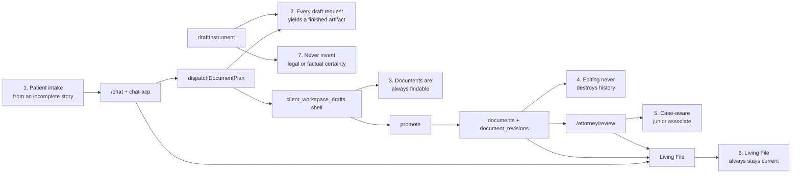

| # | Held? | Where the flow can still fail the promise |
|---|---|---|
| 1 | **Held** | One assistant. Tools always on. Bare `/chat` opens a **new** matter. Volunteer text about a second matter can still land in the current file (prompt asks; nothing enforces). |
| 2 | **Held in code; trigger is off-map** | Shell is created at dispatch. Text comes from `draftInstrument`. Truncation fails the job, does not save a fake draft. Unknown forum becomes `FORUM_PLACEHOLDER`, not a refusal. The worker runs only if something calls `POST /api/document-jobs/process`. That call is not in this repo. |
| 3 | **Held as aggregation; two identities** | The file deck and documents table read both stores. The hero CTA and the table's Continue button do **not** use the same query param. See [Naming defects that affect the flow](#naming-defects-that-affect-the-flow). |
| 4 | **Held after promote** | `saveDocumentRevision` stamps `document_revisions`. Unpromoted workspace drafts overwrite the same row. |
| 5 | **Held** | One review workbench. Associate applies on arrival; `chat-edit` does not write. Attorney owns Approve, Send, session start/end. |
| 6 | **Held for chat and `documents` writes; not for workspace-draft generation** | `saveDocumentRevision` queues Living File sync. Filling `client_workspace_drafts.content` does not. |
| 7 | **Held on the engine** | One drafter (`draftInstrument`). Calculators are read-only until `record_fact`. Forum is never defaulted. |

---

## 1. The product, in one picture

A client can have many matters. Every artifact keys off `case_file_id`.
There is one conversation, one drafting engine, one document-text write
boundary, one attorney workbench.

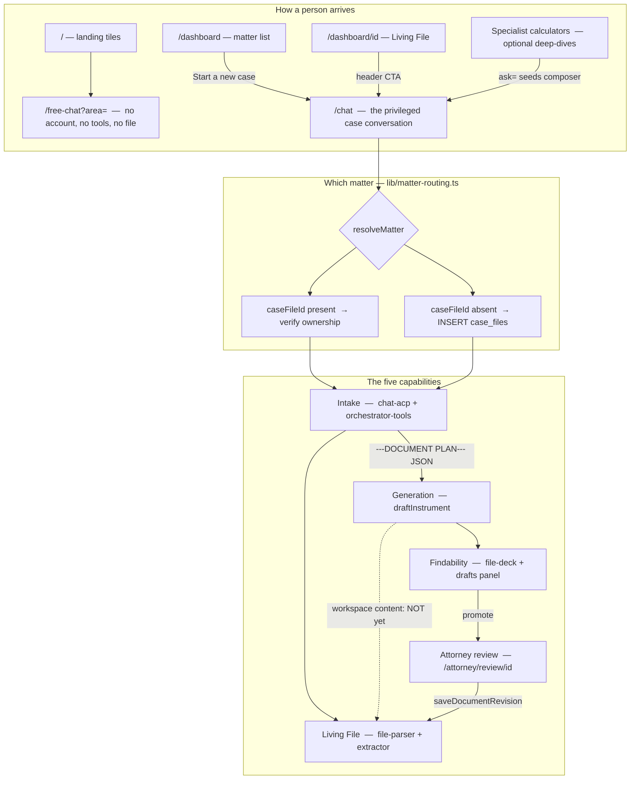

`/free-chat` is Phase I. It never becomes a matter. Calculators on their
own pages are the same math as the in-chat tools; they are not a second
drafter.

---

## 2. Which matter — no silent default

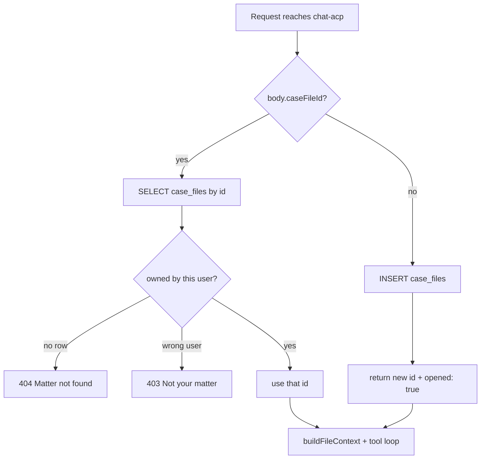

UI contract that makes this safe:

| Link | What the client meant | What routing does |
|---|---|---|
| `/chat` | Start a **new** case | Insert |
| `/chat?caseFileId=` | Resume this matter | Verify |
| `/chat?type=quick_consult` | One-off | Insert `file_type: quick_consult` |
| `/chat?area=estate` | Specialist pages still emit this | **`area` is not read.** Inserts a new matter with no area seed. |

`open_new_matter` is a tool, not a router. It inserts a second file and
returns a link. It does **not** switch the current chat session. Anything
said after that in the same thread still belongs to the file the turn
started in.

---

## 3. One chat turn

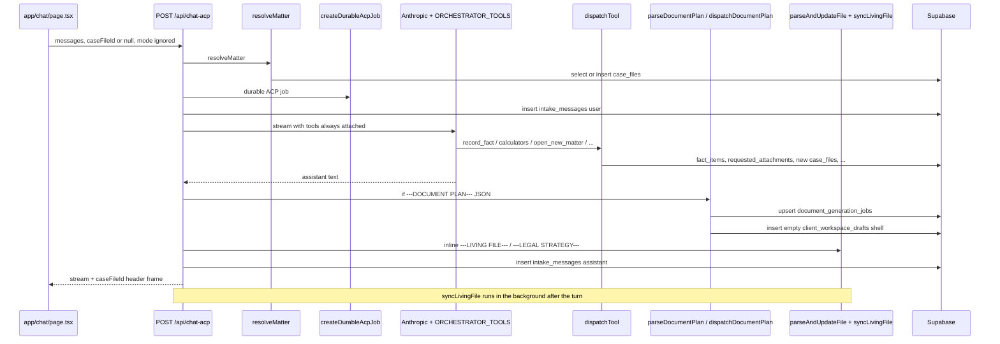

Posted `mode` is ignored. The client hardcodes `ChatMode = "freestyle"`
and still sends it. Tools are always attached when the provider is
Anthropic.

If the model preference is xAI, this turn has **no tool loop**. Calculators,
`record_fact`, and `open_new_matter` are unavailable. A `---DOCUMENT PLAN---`
block in the text can still dispatch jobs, because that parse sits after
the stream, not inside a tool.

---

## 4. How a document comes into existence

Two different things are both called a "document plan." They are not the
same object. Mixing them up is how a test can pass while the client still
has nothing to edit.

| Name in code | Marker | Parser | Writes |
|---|---|---|---|
| **Generation plan** | `---DOCUMENT PLAN---` … JSON … `---END DOCUMENT PLAN---` | `lib/document-plan.ts` → `parseDocumentPlan(text)` | `document_generation_jobs` + empty `client_workspace_drafts` |
| **Strategy plan** | `DOCUMENT PLAN:` lines inside `---LEGAL STRATEGY---` | `lib/file-parser.ts` → `parseDocumentPlan(block, prior)` | `case_files.legal_strategy.document_plan` |

Same function name. Different marker. Different table. Different purpose.

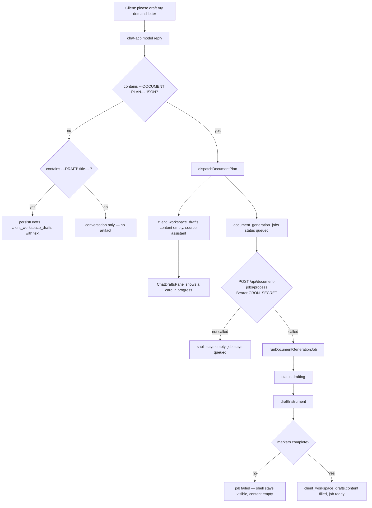

The empty shell is the north-star-2 artifact for a request in flight. It
is a card, not a ready document. Promote rejects empty content.

### The engine — one pipeline, three callers

```mermaid
flowchart LR
  subgraph callers["Callers — none of them owns drafting"]
    W["document-job-worker"]
    R["POST /api/documents/id/regenerate"]
    A["POST /api/attorney/case-files/id/draft"]
  end

  callers --> DI["draftInstrument"]

  DI --> Risk["document-risk: forum known? if not, FORUM_PLACEHOLDER"]
  Risk --> Ident["instruments/authority: pinned source"]
  Ident --> Spec["document-generation-spec"]
  Spec --> Gen["model stream + buildDrafterSystemPrompt"]
  Gen --> Mark["extractDraftText — markerless is not a draft"]
  Mark --> Refine["document-refinement"]
  Refine --> Val["instruments/validator"]
```

On truncation: the worker **fails the job**. Regenerate keeps the existing
draft and reports failure. The attorney-originated route reports failure
and creates nothing.

`.docx` rendering is a later step (`lib/doc-generator.ts`), from download
routes, not from generation.

---

## 5. Two identities until promote

This is the deferred physical merge. The flow has to live with it. Tests
that assume one id for "the draft" will flake or miss a store.

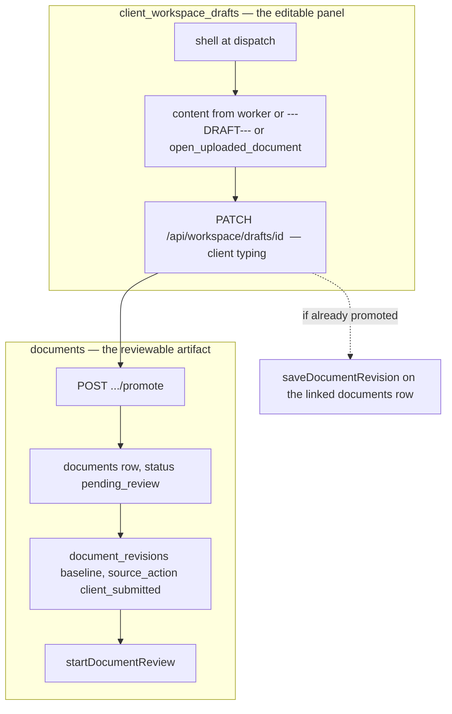

| Until promote | After promote |
|---|---|
| One row, overwritten in place | Workspace row **and** `documents` row, linked by `promoted_document_id` |
| No `document_revisions` | Immutable history starts |
| Not in the attorney queue | `pending_review`, 48-hour clock |
| Living File does not see the text via `saveDocumentRevision` | Every later text save does |

`content_json.source` on a promoted row is still `"freestyle_workspace"`.
That is wire format, not a room that exists.

Attorney-originated drafts skip this bridge: they insert a `documents` row
directly (`source: "attorney_originated"`, `status: "draft"`, `submitted_at`
null) and never enter the review queue. The client cannot download them
until Approve.

---

## 6. Findability and "what next"

One chain, downward only. Two presentations.

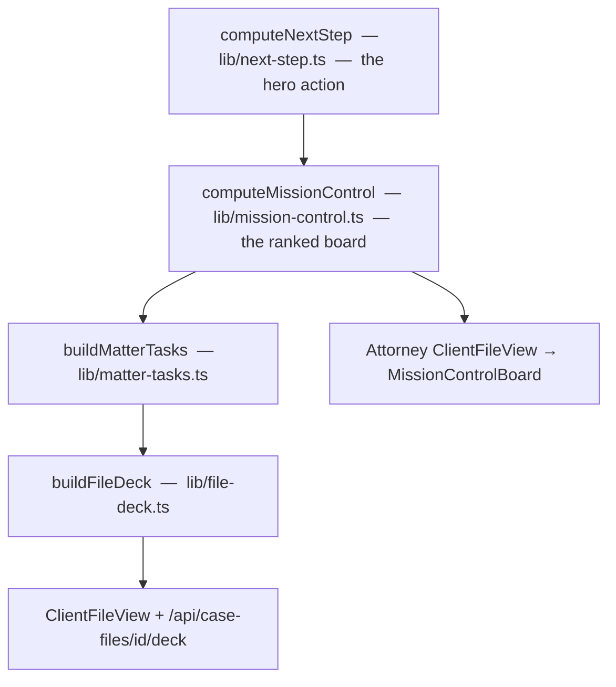

`computeNextStep` has exactly one caller. A new surface that computes "what
next" on its own is a regression.

Hero links go to `/chat?caseFileId=…&ask=…`, optionally with `&doc=<documents.id>`.
See the naming defect below: chat does not read `doc`.

`CaseDocumentsTable` is the honest finder for artifacts that already exist:

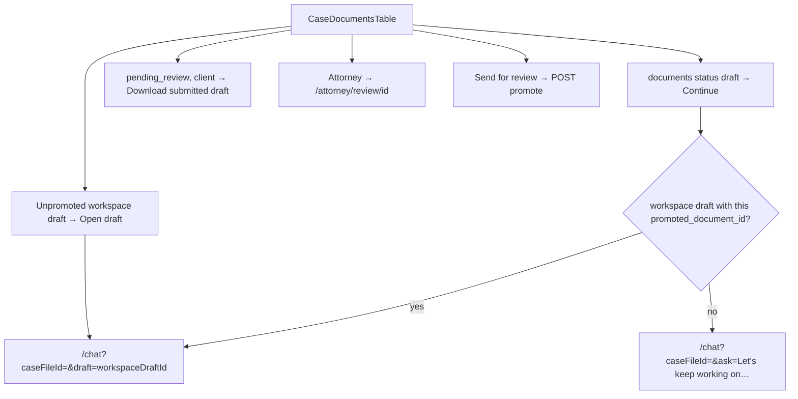

The guidance chain does **not** read `client_workspace_drafts`. A document
that exists only as a workspace shell is invisible to `computeNextStep`.
The table sees it; the hero CTA may still say "Please draft my …".

---

## 7. Attorney review — one workbench, one write path

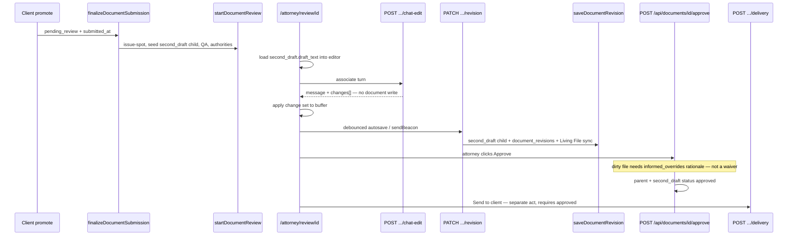

The associate must never approve, waive, or send. Empty change sets are
valid. QA runs against the working copy the attorney actually has.

Work-product rule: the `second_draft` child carries the client's `user_id`.
Download refuses an unapproved child (and an unapproved attorney-originated
parent) to a non-attorney. Approval is what makes it visible; delivery is
what sends it.

Consult uses the same teammate shape on a different thread:

| | Document review | Consult |
|---|---|---|
| Page | `/attorney/review/[id]` | `/consult/[id]/session` |
| Chat API | `.../documents/[id]/chat-edit` | `.../consult/[id]/chat` |
| Apply-on-arrival | `PATCH .../revision` | `PATCH .../wrap-up` |
| Attorney owns | Approve, Send | Start, End, Send closeout |

---

## 8. Living File — every accepted input, with one deferred hole

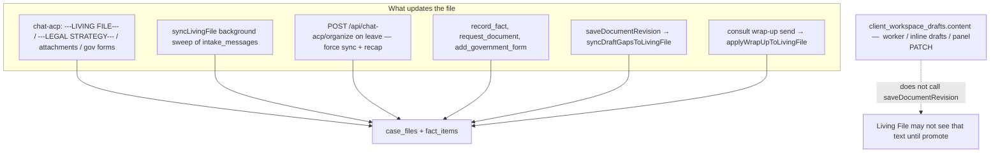

`documents.current_revision_id` is a sync marker for Living File
idempotency. It is not a foreign key to `document_revisions`.

---

## 9. Canonical names, wire names, debris

Renaming a **wire name** is a data change. Renaming **debris** is safe
only when nothing parses it. The testing risk is treating a wire name as
dead, or a debris name as live.

### Canonical — use these in new tests

| Concept | Name in code |
|---|---|
| Matter | `case_files` row, routed by `resolveMatter` |
| Drafting engine type | `InstrumentType` (`demand_letter`, `general_document`, …) |
| Human label | `INSTRUMENT_LABELS` |
| Strategy ranking | `legal_strategy.document_plan: PlanEntry[]` (`key`, `title`, `engine`, `instrument_key`) |
| Generation job type | `document_generation_jobs.document_type` (free-form slug → `coerceInstrumentType` → else `general_document`) |
| Client editable panel | `client_workspace_drafts` |
| Reviewable artifact | `documents` |
| Immutable history | `document_revisions` |
| Attorney working copy | child `documents` row, `doc_type: "second_draft"` |
| Document lifecycle | `draft` \| `pending_review` \| `changes_requested` \| `approved` \| `delivered` |
| Job lifecycle | `queued` \| `drafting` \| `waiting_for_facts` \| `checking` \| `ready` \| `failed` \| `cancelled` |
| Forum gap | `FORUM_PLACEHOLDER` (BLOCKING) |
| Text write boundary | `saveDocumentRevision` |
| Attorney-started file | `content_json.source === "attorney_originated"` |

### Wire format — still live, names frozen on purpose

| Name | Why it stays | What a test should do |
|---|---|---|
| `legal_strategy.recommended_wizards` | JSONB key on live rows | Read `document_plan` first; this is the fallback |
| `RECOMMENDED WIZARDS:` prompt block | Parser contract in `file-parser.ts` | Still emitted by **area** prompts. Strategy prompt prefers `DOCUMENT PLAN:` lines |
| `usage_events.feature = "wizard"` | Indexed cost history | Admin UI maps it to "Client draft". Do not assert the label is gone |
| `ChatMode` / `case_files.chat_mode` | Column + type | Behavior split is gone. Column is not written. Posted `mode` is ignored |
| `content_json.source = "freestyle_workspace"` | Promote stamp | Not an attorney room |

### Debris — looks live, is not on the path

| Name | Status |
|---|---|
| `/wizard/*`, `/api/wizard` | Deleted. e2e expects 404 |
| `pre_warmed` document status | Gone from TS. `preWarmedByType` argument on `computeNextStep` is always `{}` |
| Attorney freestyle / brainstorm rooms | Dropped (stage 50) |
| `workspace_draft_jobs` | Table exists, unread |
| `/api/chat-acp/sync-file` | Route exists, no UI caller (organize replaced it) |
| `POST /api/documents/[id]/submit` | API exists; production UI promotes instead |
| `/chat?area=` | Emitted by estate/tax specialist pages; **chat does not read `area`** |
| `&mode=freestyle` on dashboard / attorney links | Chat does not read `mode` from the URL |

---

## Naming defects that affect the flow

These are the places a test, or a client click, can follow the wrong name
and arrive at a dead end.

### 1. `?doc=` vs `?draft=` — hero CTA does not open the draft

`next-step.ts` and `mission-control.ts` build:

```
/chat?caseFileId=<matter>&doc=<documents.id>&ask=Let's work on my <label>.
```

`app/chat/page.tsx` reads `draft`, `caseFileId`, `ask`, `type`. It does
**not** read `doc`. Nothing in the app does.

`CaseDocumentsTable` Continue is the path that works: it maps
`promoted_document_id` back to a workspace-draft id and uses `?draft=`.

Even if `doc` were renamed to `draft`, the value is a `documents.id`, and
the panel selects a `client_workspace_drafts.id`. Two identities, two
query keys, one of them unread.

**North star 3.** The file workspace can still *list* the document. The
hero action from the guidance chain cannot *open* it. The `ask=` seed
still lands in the composer, so this is a soft dead end, not a blank
page.

### 2. Two `parseDocumentPlan` functions

| Module | Input | Output |
|---|---|---|
| `lib/document-plan.ts` | Whole assistant message | Generation jobs + shells |
| `lib/file-parser.ts` | Strategy block | `PlanEntry[]` on the Living File |

A test that imports the wrong one will parse the wrong marker and conclude
"no plan." The client next-step then falls back to `recommended_wizards`,
or to nothing.

### 3. Area prompts still say "RECOMMENDED WIZARDS" / "wizard type"

The shared strategy template asks for `DOCUMENT PLAN:` lines with
`title | engine | rationale | instrument_key`. The per-area modifiers
(HOA, family, debt, …) still say:

> in RECOMMENDED WIZARDS put ONLY the bare wizard type it drafts through

`file-parser` derives `recommended_wizards` from `document_plan` when that
parses, and only reads the old bullets when it does not. If an area
modifier wins and the model emits wizards without `DOCUMENT PLAN:` lines,
the guidance chain is on the legacy engine-keyed path: several custom
documents that share `general_document` collapse into one.

**North star 3**, for files whose strategy is written under those
modifiers.

### 4. Job `document_type` is not `InstrumentType`

The generation JSON lets the model pick a slug. The worker does
`coerceInstrumentType(job.document_type) ?? "general_document"`. An
invented type still drafts — as a general document — rather than failing.
That is the honest fallback (north star 2 + 7). A test that asserts
`document_type === engine` will be wrong whenever the model names the
instrument instead of the engine.

### 5. `ChatMode` comments still describe two products

`lib/types.ts` still documents `"intake"` vs `"freestyle"` as live
behavior. `case_files.chat_mode` is described as "persisted so reopening
resumes where the client left off." The route no longer writes it and no
longer gates on it. Tests that set `mode: "intake"` to get a weaker
assistant will not get one.

---

## Dead ends to confirm before testing generation

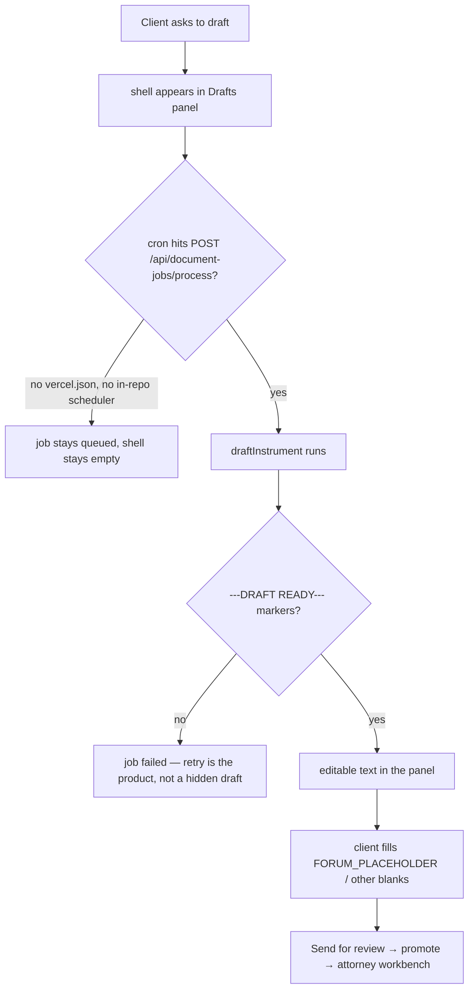

1. **Worker trigger.** `processQueuedDocumentJobs` is only imported by
   `app/api/document-jobs/process/route.ts`. There is no `vercel.json` and
   no GitHub workflow for it. Confirm the deployed cron (or equivalent)
   before treating "draft this" as an end-to-end test. The panel will
   show a card either way; only the cron fills it.
2. **`/chat?area=`** from estate/tax specialist pages. Paid chat ignores
   `area`. The client gets a generic new-matter opener, not an area-tuned
   one. `/free-chat?area=` still works.
3. **Failed generate.** Empty shell + `failed` job. Promote refuses.
   Nothing in the panel re-triggers the worker; that is also cron.
4. **xAI preference.** No tools on that turn. Patient intake that needs a
   calculator or `record_fact` will stall in prose.
5. **Volunteer second-matter text.** Routing will not guess a file, but
   extraction still writes to the current one if the client describes the
   new problem before `open_new_matter`. Deferred on purpose; do not
   treat it as a leftover to "fix" in a test setup.

---

## The happy path, named once

A client with an incomplete story, through to an approved document:

1. `/chat` → `resolveMatter` inserts `case_files`.
2. Turns accrue `intake_messages`. Tools may `record_fact` after
   confirmation. Inline `---LIVING FILE---` / extractor keep the cover
   sheet current.
3. Client asks to draft. Model emits `---DOCUMENT PLAN---` JSON.
4. `dispatchDocumentPlan` upserts `document_generation_jobs` and inserts
   an empty `client_workspace_drafts` shell. The Drafts panel shows it.
5. Worker claims the job, `draftInstrument` runs, markers required,
   forum gaps become `FORUM_PLACEHOLDER`. Content lands on the shell.
6. Client edits in the panel (`PATCH` workspace draft). History is still
   in-place.
7. Send for review → `promote` → `saveDocumentRevision` creates
   `documents` + `document_revisions` → `finalizeDocumentSubmission` →
   `pending_review` → `startDocumentReview`.
8. Attorney at `/attorney/review/[id]`. Associate change sets apply in
   the page and autosave through `/revision`. Client still cannot
   download the working copy.
9. Approve (informed override if the file is dirty). Then, separately,
   Send. Living File has been queued on every canonical text save.

If a step uses a name from the debris column, it is not this path.
